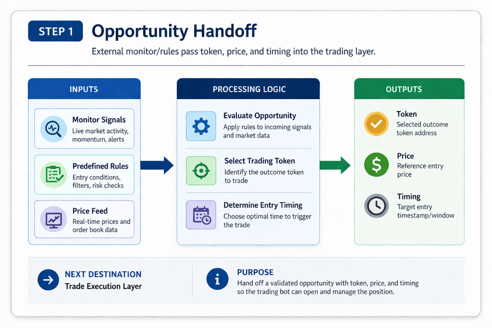
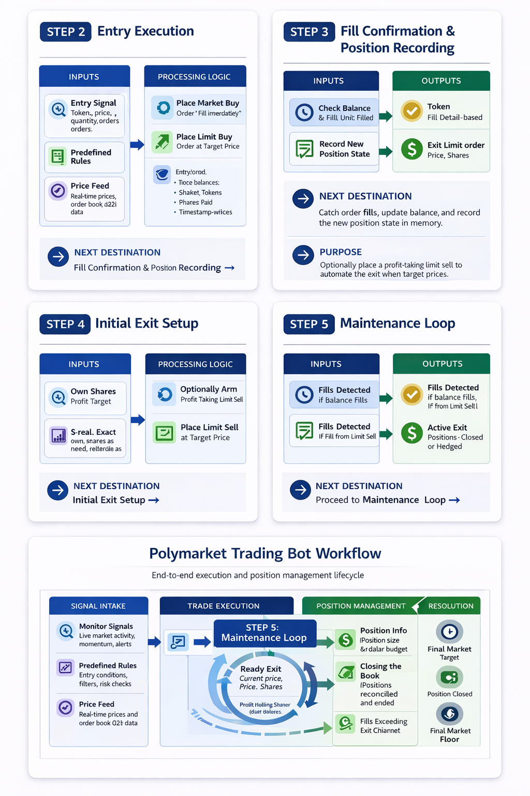

# Polymarket Trading Agent
Rust backend · Real-time Polymarket market data · Structured Polymarket trading workflow

This project is a **Polymarket trading agent** built for traders who want a more structured way to trade on **Polymarket**.

Instead of manually watching markets, refreshing positions, and reacting too late, this project helps you manage a full **Polymarket trading** workflow from one place. It is designed around live execution, open-position tracking, exit logic, settlement handling, and a local dashboard.

The goal is simple:

- make **Polymarket trading** easier to understand
- make **trading** execution more structured
- make position management more practical
- help users understand the full **Polymarket trading** lifecycle
- keep everything fast and local

---

## What this Polymarket trading agent does

With this **Polymarket trading agent**, you can:

- monitor live **Polymarket** market activity
- manage **trading** entries and exits
- track open positions in real time
- run the agent in simulation mode before live **trading**
- follow a structured **Polymarket trading** lifecycle from entry to settlement

If you already trade on **Polymarket**, this project is meant to make your **trading** process more organized and easier to manage.

---

## Main idea of the trading logic

The easiest way to understand this **Polymarket trading agent** is:

1. something outside the trading layer finds an opportunity
2. it passes a token, price, and timing into the agent
3. the agent opens a position
4. the agent keeps that position in memory
5. the agent keeps managing that position until exit or settlement

This means the system is split into two parts:

### 1) Opportunity handoff
A separate monitor or rules layer decides:

- this **Polymarket** market is interesting
- this token should be traded
- this is the entry price
- this is the timing

### 2) Trade execution and management
Once that information is handed off, the **trading agent** does the rest:

- open the trade
- record the position
- wait for fill confirmation
- place exit orders
- manage stop-loss and take-profit logic
- monitor the position in a loop
- settle or redeem when the market ends
- keep internal state aligned with the real wallet

So this repository is focused on the full life of a trade, not just signal discovery.

---

## Core trading model: open positions in memory

At the center of this **Polymarket trading** logic is a list of **open positions** stored in memory.

Each open position remembers:

- which **15-minute Polymarket market** it belongs to
- which outcome token was bought
- how many shares were bought
- what price was paid
- how the trade was opened
- whether exit orders exist
- what should happen next

That “what should happen next” can mean:

- exit at a profit target
- stop out if price falls
- hold to market settlement
- hedge using the opposite outcome
- close if a limit sell was filled

This matters because **Polymarket trading** is not only about entry. Most of the logic happens after the trade is already open.

A background loop runs often and checks every open position. That loop handles:

- balances
- prices
- fill detection
- exit order placement
- stop-loss triggers
- target exits
- settlement checks
- cleanup of closed positions

So the agent behaves like a live position manager for **Polymarket trading**.

---

## How a position starts

This **Polymarket trading agent** supports two main entry styles.

## 1) Market-style entry

This is used when the agent wants fast entry.

How it works:

- the agent uses a roughly fixed dollar budget from config
- it sends a buy that must fill immediately in full or cancel
- partial fill is not accepted
- after the order is accepted, the agent polls wallet balance
- when shares appear, it records the position using the actual share count

This path is useful for momentum-style **Polymarket trading** where fast entry matters.

Mental model:

- opportunity appears
- buy now
- confirm shares
- start managing the position

## 2) Limit-style entry

This is used when the agent wants more controlled entry.

How it works:

- the agent places a limit buy at a chosen price
- order size is based on the configured budget and limit price
- before placing the order, it records the current balance
- later, it checks for a balance increase
- if balance increased, it treats that as proof the limit buy filled
- then it updates the position with the new filled amount

This path is useful when price quality matters more than immediate execution.

Optional behavior:

- during some testing or bookkeeping modes, the agent can record positions without placing follow-up sells

---

## What happens right after a buy

Once a buy is confirmed, the **Polymarket trading agent** usually prepares the position for exit management.

### Market-style path after shares appear

When a market-style buy is confirmed:

- the agent often posts a resting limit sell at the profit target
- this gives the position a pre-armed exit
- that means you do not need to rely only on later manual reaction

### Limit-style path after fill

When a limit buy is detected as filled:

- the agent updates the position state
- it may place one limit sell at the configured profit target
- that can be skipped in special bookkeeping modes

So after entry, the system tries to convert the trade into a managed position.

---

## The maintenance loop: the heart of the trading agent

The repeating maintenance loop is the most important part of this **Polymarket trading agent**.

This loop runs on a timer and walks through every open position.

That is what allows the agent to keep reacting while a **Polymarket** market is still active.

Below is the easiest way to understand that loop.

### 1) Simulation branch

If the agent is running in simulation mode:

- it uses simulated order books and internal fill logic
- it tracks which orders would fill
- it tracks how positions would behave until market end
- it does not send real orders like production mode

This makes it possible to understand the **trading** logic before using real money.

### 2) Detect limit buy fills

For positions opened with a limit buy:

- the agent compares current balance with the balance before the order
- if shares increased, the buy is treated as filled
- the position size is updated
- the agent may then place a profit-target limit sell

This is one of the key ideas in the system:
fill detection can be based on real balance change.

### 3) Detect limit sell fills

For positions that already placed limit sells:

- the agent checks whether the token balance is now close to zero
- if yes, it treats the sell as completed
- then it closes the position in the internal ledger

This helps the **Polymarket trading agent** stay aligned with actual wallet state.

### 4) Market-style follow-up

For positions that came from market entry:

- if shares are confirmed
- and if a protective exit sell is not already on the book
- the agent can place one profit-target limit sell for the full balance

This means the agent can enter aggressively and then manage the exit more carefully.

### 5) Active management while still holding shares

This is the core live **trading** behavior.

For every still-open position, the agent does the following:

#### Read the current sellable price
It checks the price the agent could realistically get by selling now.

This is more useful than just reading a last traded price.

#### Skip if there is no liquidity
If there are no real buyers in the order book:

- the agent avoids trying to sell into empty liquidity
- it waits instead of forcing bad execution

Liquidity matters a lot in **Polymarket trading**.

#### Stop-loss logic
If the sellable price falls below the configured stop-loss level:

- the agent tries to exit using a market-style sell
- it can retry with backoff
- after a successful stop, hedge logic may activate

#### Hedge logic
After a stop-loss exit, the agent may optionally interact with the opposite outcome.

That means it can:

- buy the opposite side
- or place limit orders on the opposite side
- using levels derived from the stop configuration

This is used to partly manage outcome-pair exposure instead of only closing the original side.

#### Profit target logic
If the price reaches or exceeds the configured target:

- the agent attempts to close the position with a market-style sell
- it can retry if needed
- if price moves away before the exit succeeds, the attempt may be abandoned and the position returns to monitoring

That means target detection is not enough by itself. The agent still has to deal with real market conditions.

#### Opposite-side special stop logic
If a position was created as part of a hedge, it can use its own stop behavior.

That matters because a hedge position is not always managed exactly like the original position.

### 6) Settlement

When the **15-minute Polymarket market** ends:

- another process checks whether the market has resolved
- winning positions are redeemed
- losing positions are written off
- retries are used when needed
- after too many failures, the agent stops retrying forever

This matters because **Polymarket trading** does not end only when you stop watching price. Some positions must still be settled or redeemed.

### 7) Reconciliation

Sometimes internal state and the real wallet can drift apart.

For example:

- the wallet balance is already zero
- but the agent still thinks the position is open

So the system periodically reconciles internal state with the real portfolio.

If the real balance is zero:

- the position is marked closed
- the agent stops trying to sell or redeem a ghost position

This makes long-running **Polymarket trading** more stable.

---

## Simple mental model of the full trading flow

The easiest one-paragraph explanation is:

A separate monitor or rules layer discovers an opportunity in **Polymarket** and hands the trading layer a token, price, and timing. The **Polymarket trading agent** opens the position with either a market buy or a limit buy, records that position in memory, waits for fill confirmation, optionally places a profit-taking limit sell, and then repeatedly watches price, liquidity, stop-loss, target exits, hedge conditions, and settlement state until the trade is fully closed, redeemed, or written off.

---

## Simulation vs production

This **Polymarket trading agent** supports both simulation and production.

### Production mode

Production uses:

- real orders
- real balances
- real polling
- real order book interaction
- real limit orders
- real market sells
- real settlement handling
- real redemption when needed

This is the live **Polymarket trading** path.

### Simulation mode

Simulation uses:

- simulated fills
- simulated order book behavior
- internal state tracking
- hold-to-expiry behavior in many cases
- PnL at resolution
- winner resolves to `$1`
- loser resolves to `$0`

Simulation is useful for learning how the **trading logic** behaves without risking capital.

---

## Workflow diagrams




---

## Getting started

You do not need to understand the full codebase before using this **Polymarket trading agent**.

Just follow the setup below.

## 1) Clone the project

```bash
git clone https://github.com/brunobmtx/polymarket-trading-agent.git
cd polymarket-trading-agent
````

## 2) Add your Polymarket credentials

Create a `config.json` file in the project root.

This file is for your **Polymarket** CLOB credentials and wallet setup.

```jsonc
{
  "polymarket": {
    "gamma_api_url": "https://gamma-api.polymarket.com",
    "clob_api_url": "https://clob.polymarket.com",
    "api_key": "your-api-key",
    "api_secret": "your-api-secret",
    "api_passphrase": "your-api-passphrase",
    "private_key": "your-private-key",
    "proxy_wallet_address": null,
    "signature_type": 0
  }
}
```

This is the core connection between your local environment and **Polymarket trading**.

## 3) Define your trading behavior

Create a `trade.toml` file in the project root.

This file controls how the **Polymarket trading agent** behaves.

```toml
[entry]
trade_amount_usd = 10
entry_mode = "market" # or "limit"
poll_interval_sec = 0.5

[exit]
take_profit = 0
stop_loss = 0
trailing_stop = 0

[filter]
entry_trade_sec = 0
trade_sec_from_resolve = 0
```

Important notes:

* `trade_amount_usd` defines the approximate budget per trade
* `entry_mode` controls how the agent enters
* `[exit]` defines protection and target logic
* `[filter]` helps narrow when the agent is allowed to trade

## Test first with simulation mode

Use simulation mode before live **trading** if you want to understand the logic first.

```bash
cargo run --release --bin main_trading -- --simulation
```

Simulation mode is useful for:

* testing your setup
* checking your **trading** configuration
* understanding the **Polymarket trading** lifecycle
* reviewing how entry and exit logic behaves
* exploring the dashboard safely

---

## Requirements

Before running this **Polymarket** project, make sure you have:

* **Rust 1.70+**
* a **Polymarket** account
* USDC on Polygon
* **Polymarket** CLOB API credentials
* frontend tooling:

  * `cargo install trunk`
  * `rustup target add wasm32-unknown-unknown`

---

## Basic Polymarket trading flow

```text
Polymarket market data / opportunity handoff
        ↓
select token, price, and timing
        ↓
open trade with market or limit entry
        ↓
record position in memory
        ↓
watch fills, price, liquidity, and exits
        ↓
take profit, stop out, hedge, or hold
        ↓
settle or redeem at market resolution
        ↓
sync internal state with wallet
```

This is the core lifecycle of the **Polymarket trading agent**.

---

## Config explanation

## `config.json`

This handles your **Polymarket** credentials and wallet settings.

Important fields:

* `clob_api_url` → usually `https://clob.polymarket.com`
* `private_key` → your Polygon wallet private key
* `api_key`, `api_secret`, `api_passphrase` → your **Polymarket** API credentials
* `proxy_wallet_address` → optional
* `signature_type` → wallet signing mode

## `trade.toml`

This controls your **trading** behavior.

Important areas:

* `[entry]` → trade amount, entry mode, and polling behavior
* `[exit]` → take profit, stop loss, trailing logic
* `[filter]` → time-based or opportunity-based constraints
* `[ui]` → dashboard behavior if used in your local setup

---

## Project structure

This repository is the backend **trading** engine behind the Polymarket dashboard.

It is centered on Rust **trading logic** and uses the `polymarket-client-sdk` crate for **Polymarket** API, data, and websocket access.

### Core library modules

* `src/lib.rs`
  Library entry point, module exports, and shared history logging helpers

* `src/api.rs`
  High-level **Polymarket** API wrapper built on top of `polymarket-client-sdk`

* `src/config.rs`
  Config structs, defaults, and CLI/runtime configuration loading

* `src/models.rs`
  Shared domain models for markets, tokens, prices, and **trading** state

* `src/merge.rs`
  Merge-related helpers for outcome token handling

### Trading and execution

* `src/trader.rs`
  Main **trading** engine, order placement flow, position management, and execution logic

* `src/simulation.rs`
  Simulation and dry-run behavior for testing strategies without live execution

* `src/detector.rs`
  Signal and opportunity detection logic used before trade execution

### Monitoring and market tracking

* `src/monitor.rs`
  Market monitoring loop, price tracking, and runtime coordination for strategies

### Binaries

* `src/bin/main_trading.rs`
  Main strategy entry point and current default run target

* `src/bin/main_price_monitor.rs`
  Standalone market and price monitor binary

### Utility and test binaries

* `src/bin/test_allowance.rs`
* `src/bin/test_limit_order.rs`
* `src/bin/test_merge.rs`
* `src/bin/test_predict_fun.rs`
* `src/bin/test_redeem.rs`
* `src/bin/test_sell.rs`

## Who this project is for

This project is a good fit if you are:

* active on **Polymarket**
* interested in structured **trading**
* trying to improve your execution workflow
* managing short-window **Polymarket** positions
* looking for a local-first **trading agent**
* interested in better position management and settlement handling

It is especially useful if you want faster execution and a more organized **trading** process.

---

## References

* [Polymarket CLOB Documentation](https://docs.polymarket.com/developers/CLOB/)
* [Polymarket API Reference](https://docs.polymarket.com/api-reference/introduction)
* [Mahoraga](https://mahoraga.dev/)

---

## Future plan

In version 2, I will implement AI-based features for new functionality such as risk management, smarter market evaluation, and improved trading support.

---

For the best version of this product, contact me.

**Contact:** [@snipmaxi](https://t.me/snipmaxi)